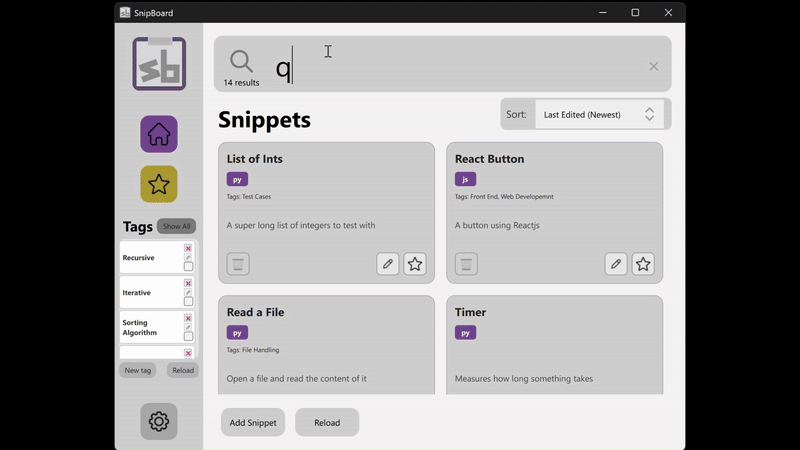

# SnipBoard

## Project Description
SnipBoard is a fast, organized, and searchable desktop tool for storing and retrieving personal code snippets.  
Its purpose is to help developers stay focused, reuse their best code, and eliminate the time wasted digging through old projects, screenshots, and notes for small pieces of reusable logic.
SnipBoard has a [VSCode extension](https://github.com/Ohio-University-CS/snipboard-extension) that works with our application.

## Demo Videos
<div style="display: flex; gap: 20px; justify-content: center;">
  <div style="flex: 1; text-align: center;">
    <h3>SnipBoard App</h3>
    
  </div>
  <div style="flex: 1; text-align: center;">
    <h3>VSCode Extension</h3>
    
  </div>
</div>  

## Features
- Fast, flexible search (name, description, tags, language)
- Tag-based snippet organization
- Favorites system for quick access
- Native VSCode extension for in-editor snippet insertion
- Local, offline storage using SQLite
- Cross-platform desktop app built with Qt
- C++ backend for speed and reliability

## Installation
<!-- Fill in exact installation instructions here -->
- Install Qt (version 6.10.0)
  - If on Windows, ensure install is the same as
    ```
    C:/Qt/6.10.0/
    ```
- Install required dependencies:  
  - C++ compiler  (g++)
  - CMake / Qt Creator  
  - SQLite (bundled)

## How to Run
**macOS**
1. Install Qt  
2. Create a `sign.sh` file and add:
    ```bash
    codesign --remove-signature ./build/SnipBoard.app
    codesign --force --deep --sign - ./build/SnipBoard.app

    QT_PATH=$(brew --prefix qt)
    export QML_IMPORT_PATH="$QT_PATH/share/qt/qml"
    export DYLD_FRAMEWORK_PATH=./build/SnipBoard.app/Contents/Frameworks

    ./build/SnipBoard.app/Contents/MacOS/SnipBoard
    ```
3. Build the project
4. If first time building, run
    ```bash
    sqlite3 ./snipboard/snipboard.db < ./db/snipboard.sql
    ```
5. Run `./sign.sh` in the terminal

**Windows**
1. Click *Build*
2. If first time building, run 
    ```ps
    sqlite3 .\build\snipboard.db --init .\db\snipboard.sql
    ```
3. Click *Run/Launch*

## Usage Examples
<!-- Add screenshots or snippet examples here -->
- Searching for a snippet  
- Adding a new snippet  
- Tagging and organizing  
- Using the VSCode extension  

## Known Issues
-  Some settings are not yet fully implemented
-  Editing Snippets in certain sorting methods may not keep sorted order
-  When building for the first time, database migrations are not performed

## Future Work
- Enterprise version with shared team snippet libraries  
- Smart snippet generation (auto-detect reusable patterns in codebases)  
- Integrations for JetBrains, Visual Studio, NeoVim  
- Cloud sync + teams dashboard  
- Enhanced search ranking  
- More snippet metadata + improved import/export  

## Contributors
-  Kyle Carey: Backend + VSCode Extension
-  Davis Lewis: Backend (Database + Repositories)
-  Lucas Filla: Frontend
-  Jack Hensley: Frontend
-  Grant Schafer: Color Scheme

## Attributions
1. Star Icon — Pixel perfect ([Flaticon](https://www.flaticon.com/free-icons/star))  
2. Search Icon — Royyan Wijaya ([Flaticon](https://www.flaticon.com/free-icons/magnifying-glass))  
3. Settings Icon — Ilham Fitrotul Hayat ([Flaticon](https://www.flaticon.com/free-icons/settings))  
4. Folder Icon — dmitri13 ([Flaticon](https://www.flaticon.com/free-icons/folder))  
5. Home Icon — Freepik ([Flaticon](https://www.flaticon.com/free-icons/home-button))  
6. Gold Star Icon — Pixel perfect ([Flaticon](https://www.flaticon.com/free-icons/star))
